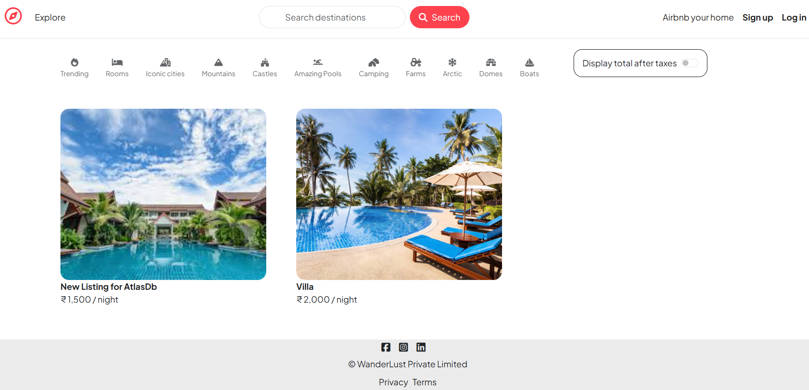
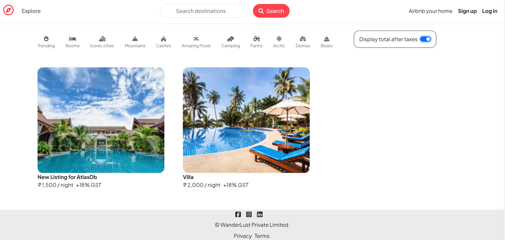
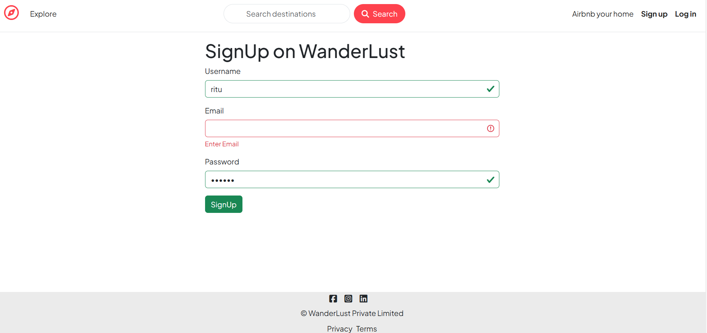
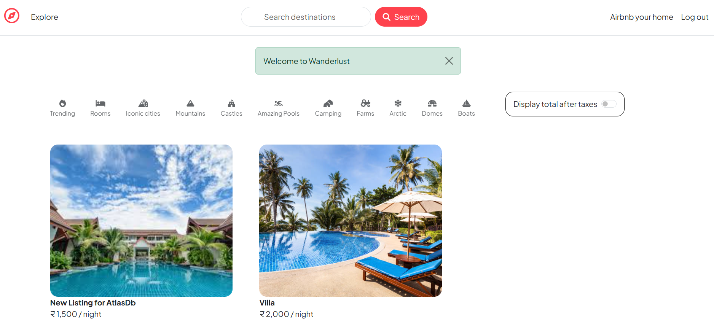
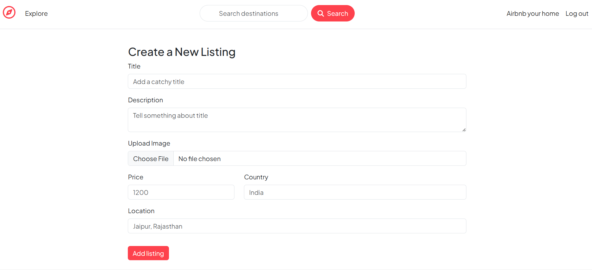
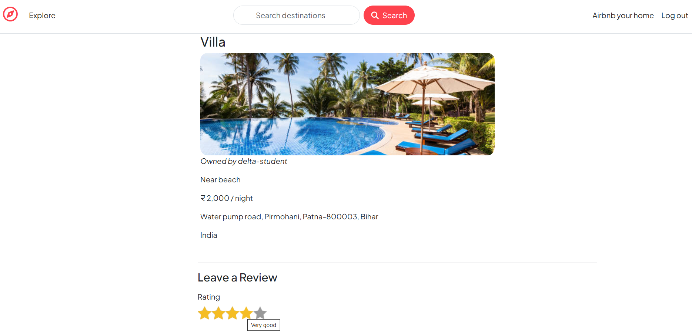
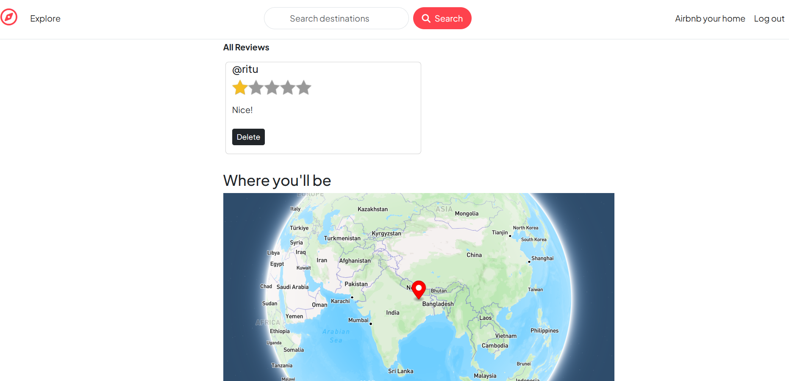
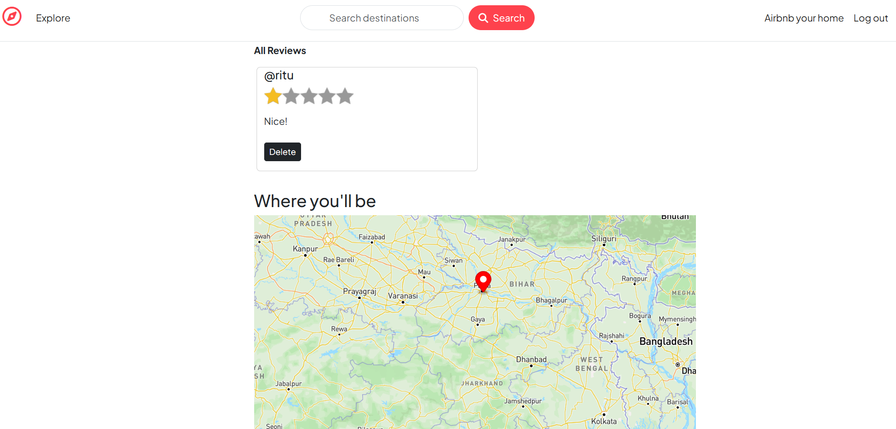
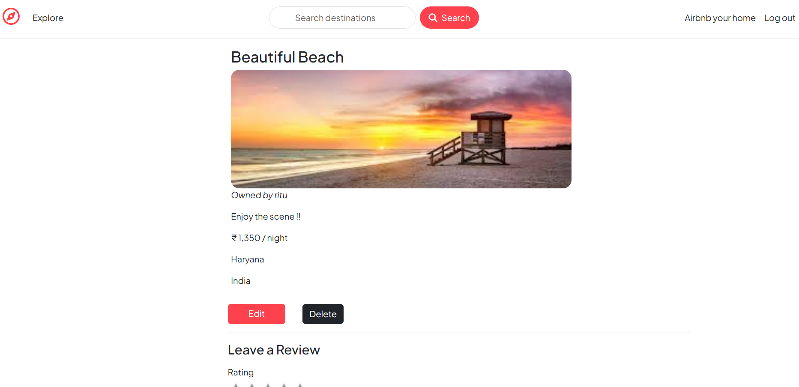

<h1 align="center">🧭 WanderLust</h1>

<p align="center">
  <b>A full-stack Airbnb-style rental platform</b> where users can list, explore, review and book stays around the world.
</p>

<p align="center">
  
  
  
  
  
  
  
  
  
</p>

---

## 📖 About The Project

**WanderLust** is a complete full-stack web application inspired by Airbnb. It allows users to sign up, create property listings with images, explore listings on an interactive map, and leave reviews & ratings. The app implements full **authentication & authorization**, **cloud image storage**, **server-side validation**, and a clean **MVC architecture** built with Node.js, Express and MongoDB.

---

## ✨ Features

- 🔐 **User Authentication** — Sign up, log in & log out using Passport.js (session-based auth)
- 🏠 **Listings CRUD** — Create, read, update and delete property listings
- 🖼️ **Image Uploads** — Upload listing images stored on **Cloudinary** (via Multer)
- 🗺️ **Interactive Maps** — Every listing is geocoded with **Mapbox** and shown on a live map
- ⭐ **Reviews & Ratings** — Authenticated users can post and delete star-based reviews
- 🛡️ **Authorization** — Only owners can edit/delete their listings; only authors can delete their reviews
- 💸 **Tax Toggle** — Switch to display total price including **18% GST**
- ✅ **Server-Side Validation** — Schema validation with **Joi**
- 🚨 **Flash Messages & Error Handling** — Friendly success/error feedback and a custom error page
- ☁️ **Cloud Database** — Data persisted on **MongoDB Atlas** with sessions stored in Mongo

---

## 🖼️ Screenshots

### 🏡 Home / Explore Page
<p align="center">
  
</p>

### 💸 Display Total After Taxes (18% GST)
<p align="center">
  
</p>

### 📝 Sign Up
<p align="center">
  
</p>

### 🎉 Logged In (Welcome)
<p align="center">
  
</p>

### ➕ Create a New Listing
<p align="center">
  
</p>

### 🔍 Listing Details + Leave a Review
<p align="center">
  
</p>

### ⭐ Reviews
<p align="center">
  
</p>

### 🗺️ Where You'll Be (Mapbox)
<p align="center">
  
</p>

### ✏️ Owner View (Edit / Delete)
<p align="center">
  
</p>

---

## 🛠️ Tech Stack

| Layer | Technology |
|-------|------------|
| **Frontend** | EJS templates, EJS-Mate (layouts), Bootstrap 5, Custom CSS, vanilla JS |
| **Backend** | Node.js, Express.js (v5) |
| **Database** | MongoDB Atlas + Mongoose ODM |
| **Authentication** | Passport.js, passport-local, passport-local-mongoose |
| **Sessions** | express-session + connect-mongo (Mongo session store) |
| **File Uploads** | Multer + multer-storage-cloudinary + Cloudinary |
| **Maps / Geocoding** | Mapbox SDK |
| **Validation** | Joi |
| **Utilities** | connect-flash, method-override, dotenv |

---

## 📂 Project Structure

```
Wanderlust/
├── app.js                  # Entry point — Express config, sessions, passport, routes
├── cloudConfig.js          # Cloudinary + Multer storage configuration
├── middleware.js           # Auth, authorization & validation middleware
├── schema.js               # Joi validation schemas (listing & review)
├── controllers/            # Route-handling logic (MVC "Controller")
├── models/                 # Mongoose schemas (MVC "Model")
├── routes/                 # Express routers
├── views/                  # EJS templates (MVC "View")
├── public/                 # Static assets (CSS / JS / images)
├── screenshots/            # README screenshots
├── utils/                  # ExpressError & wrapAsync helpers
├── init/                   # DB seeding script & sample data
└── package.json
```

---

## ⚙️ Getting Started

### Prerequisites

- [Node.js](https://nodejs.org/) (v18+)
- A [MongoDB Atlas](https://www.mongodb.com/atlas) account
- A [Cloudinary](https://cloudinary.com/) account
- A [Mapbox](https://www.mapbox.com/) account

### Installation

```bash
# 1. Clone the repository
git clone https://github.com/Om14kumar/Wanderlust---Full-Stack-rental-platform.git
cd Wanderlust---Full-Stack-rental-platform

# 2. Install dependencies
npm install

# 3. Create a .env file in the root (see below)

# 4. (Optional) Seed the database
node init/index.js

# 5. Start the app
node app.js
```

The app runs at **http://localhost:8080**.

### Environment Variables (`.env`)

```env
ATLASDB_URL=your_mongodb_atlas_connection_string
SECRET=your_session_secret

CLOUD_NAME=your_cloudinary_cloud_name
CLOUD_API_KEY=your_cloudinary_api_key
CLOUD_API_SECRET=your_cloudinary_api_secret

MAP_TOKEN=your_mapbox_access_token
```

---

## 🔗 API / Routes Overview

| Method | Route | Description | Access |
|--------|-------|-------------|--------|
| `GET` | `/listings` | Show all listings | Public |
| `GET` | `/listings/new` | New listing form | Logged in |
| `POST` | `/listings` | Create a listing | Logged in |
| `GET` | `/listings/:id` | Show a listing | Public |
| `GET` | `/listings/:id/edit` | Edit form | Owner |
| `PUT` | `/listings/:id` | Update a listing | Owner |
| `DELETE` | `/listings/:id` | Delete a listing | Owner |
| `POST` | `/listings/:id/reviews` | Add a review | Logged in |
| `DELETE` | `/listings/:id/reviews/:reviewId` | Delete a review | Author |
| `GET` / `POST` | `/signup` | Register | Public |
| `GET` / `POST` | `/login` | Log in | Public |
| `GET` | `/logout` | Log out | Logged in |

---

## 🚀 Future Enhancements

- 🔎 Search & category filtering
- 📅 Booking & availability calendar
- 💳 Payment gateway integration (Stripe / Razorpay)
- ❤️ Wishlist / favourites
- 📱 Fully responsive PWA

---

## 👤 Author

**Om Kumar**

- GitHub: [@Om14kumar](https://github.com/Om14kumar)

---

<p align="center">⭐ If you like this project, give it a star! ⭐</p>
